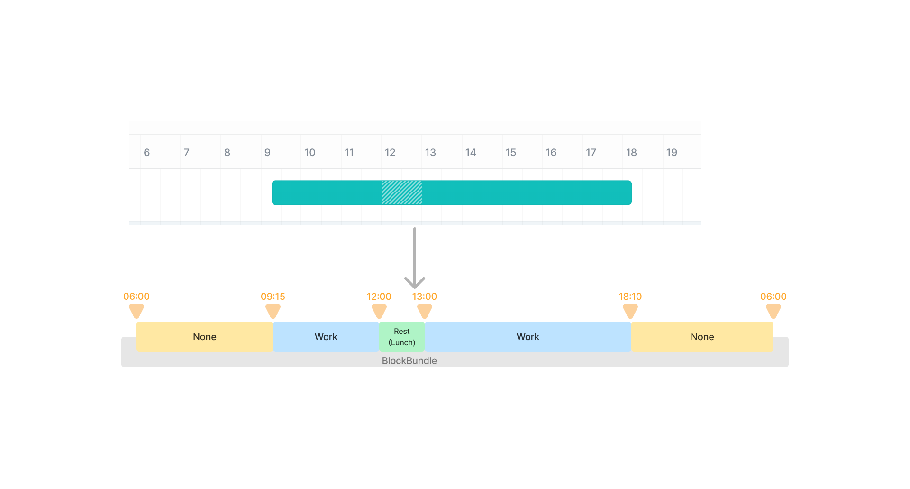

# @devsisters/flex-workblock

FLEX의 근무시간을 Block과 BlockBundle이라는 개념으로 재구성하여, 각종 근무시간 계산을 도와줍니다!

# 설명

- 위의 청록색 블럭은 FLEX의 근무시간 탭에서 볼 수 있는 `근무내역`입니다.
- FLEX 공식 api은 위 `근무내역`을 지원하지 않으며, 현재 사내에서 아래 방법들로 이용중입니다.
  - FLEX에서 제공하는 근무 리포트 다운로드로 csv 파일로 받아올 수 있습니다.
  - 리버스 엔지니어링을 통해 분석하고 있습니다.
- 이렇게 받아오는 데이터들은 방법마다 다른 스키마를 갖고 있으며, 심지어는 FLEX가 업데이트를 통해 스키마가 갑자기 변경되기도 합니다.
- FLEX의 버그인지 비직관적인 데이터가 내려오기도 합니다.
- 그래서 이 `근무내역`들을 우리만의 `Block`과 `BlockBundle`이라는 개념으로 재정의하고, 근무시간 관련 계산을 돕는 모듈들을 이 패키지에서 제공합니다.

# 제공하는 모듈
## Block
- XX:XX ~ XX:XX 사이의 근무내역을 담는 블럭입니다.
- None(비근무), Work(근무), Rest(휴게) 3가지 타입이 있습니다.

```typescript
export declare class Block {
  startAt: Date; // 시작 시간
  endAt: Date; // 종료 시간
  type: BlockType; // 근무, 비근무, 휴게 중 하나
  constructor(startAt: Date, endAt: Date, type: BlockType);

  // 블럭의 길이(기간)
  // ex) 13:00~14:00 블럭의 duration은 { hours: 1 }
  get duration(): Duration; 

  //interval과 겹치는 블럭의 길이(기간)
  //ex) 13:00~14:00 블럭과 
  // { start: "13:20", end: "14:10" } interval의 overlappedDuration은
  // { minutes: 50 }
  overlappedDuration(interval: Interval): Duration; 
  
  // 12:00~13:00인 휴게 블럭인 경우 "Lunch"를 반환
  // 이외에는 null
  get subtype(): BlockSubtype | null;
}
```

## BlockBundle
- Block들을 빈틈없이, 순서대로 관리해주는 BlockBundle이라는 개념입니다
- BlockBundle에 addBlock, addBlocks로 Block을 추가해주면, 항상 이 BlockBundle 속의 Block들이 정돈된 상태로 유지됩니다.

### 예시
- BlockBundle을 처음 생성하였을때 (06:00~18:00)
  - blocks: [`06:00~18:00 미근무`]
- BlockBundle.addBlock(`09:00~17:00 근무`) 실행시
  - blocks: [`06:00~09:00 미근무`, `09:00~17:00 근무`, `17:00~18:00 미근무`]
- BlockBundle.addBlock(`12:00~13:00 근무`) 실행시
  - blocks: [`06:00~09:00 미근무`, `09:00~12:00 근무`, `12:00~13:00 휴게`, `13:00~17:00 근무`, `17:00~18:00 미근무`]

- 이런식으로 정렬됩니다.

```typescript
export declare class BlockBundle {
  startAt: Date; //시작 시간
  endAt: Date; //종료 시간
  blocks: Block[]; //Block들
  constructor(startAt: Date, endAt: Date);
  addBlock(block: Block): void; //Block 한개 추가
  addBlocks(blocks: Block[]): void; //Block 여러개 추가
  popBlock(indexOf: number): void;  //Block 한개 제거
  popBlocks(indexFrom: number, count: number): void; //Block 여러개 제거
  getBlockAt(date: Date): Block; //해당 시간에 겹쳐있는 Block 반환
  getBlocksBetween(from: Date, to: Date): Block[]; //해당 시간들 사이에 겹쳐있는 Block들 반환
  get didWork(): boolean; //이날의 근무기록이 있는지 T/F
}
```

## 계산 함수들
```typescript
declare const _default: {
  //duration을 분 단위로 환산해줍니다
  //주의: hours, minutes 외에는 무시합니다 TODO 
  durationToMinutes(duration: Duration): number;
  
  //코어타임 미이수 시간을 계산합니다
  //ex) 221031 06:00~ 221101 06:00의 BlockBundle을 만들어놓고, 10:00~16:00을 코어타임 시작, 종료 시간으로 넘겨주면
  //그날의 코어타임 미이수 시간을 반환함 
  getMissedCoreTime(bundle: BlockBundle, coretimeStartAt: Date, coretimeEndAt: Date): Duration;

  //지각 여부와 지각 시간을 계산합니다
  //ex) 221031 06:00~ 221101 06:00의 BlockBundle을 만들어놓고, 10:00~16:00을 코어타임 시작, 종료 시간으로 넘겨주면
  //그날의 지각 여부와 지각 시간을 반환함 
  getLateInfo(bundle: BlockBundle, coretimeStartAt: Date, coretimeEndAt: Date): functions.LateInfo;
};
```